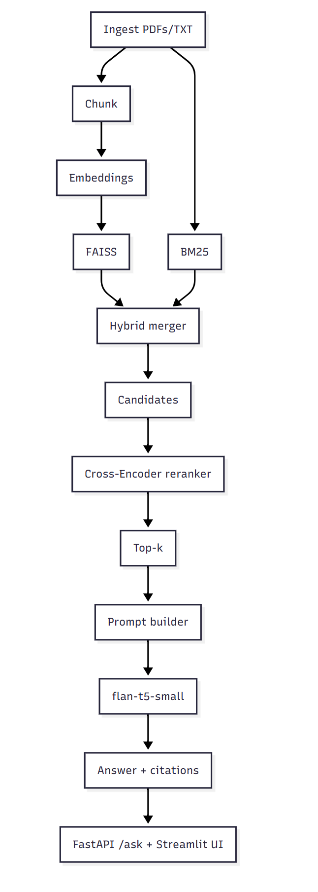
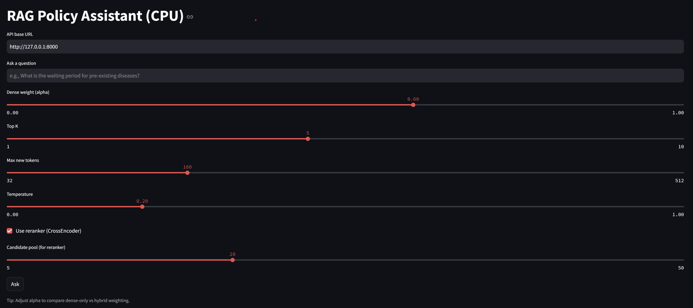
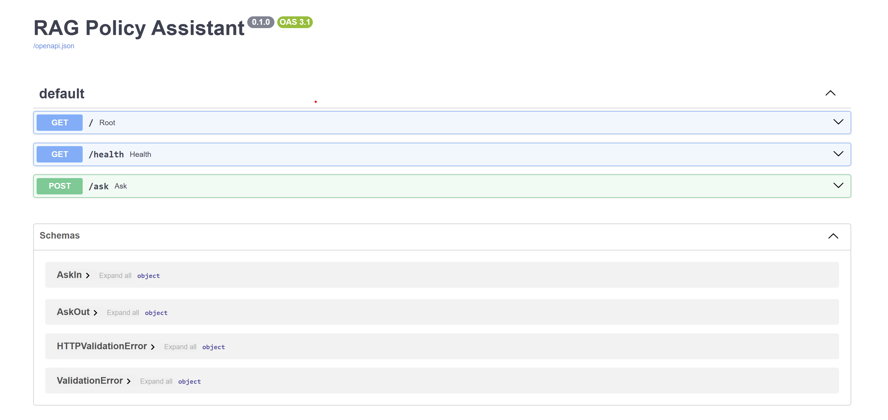

RAG Policy Assistant (CPU-friendly)

    End-to-end RAG over policy/regulatory docs: ingestion, chunking, hybrid retrieval (FAISS + BM25), FastAPI /ask, Streamlit UI.
    
    Models: all-MiniLM-L6-v2 (embeddings), flan-t5-small (generation).
    
    Everything runs on CPU. Run from the project root with python -m so src imports work.

Quick start

    python -m pip install -r requirements.txt
    python -m scripts.build_index
    python -m uvicorn src.app:app --reload --port 8000 (open http://127.0.0.1:8000/docs)
    streamlit run src/ui_streamlit.py (in another terminal)

<!-- Architecture Diagram -->
Architecture (high level)

Metrics

Recall@3 improved from 0.60 to 0.85 with reranker on sample set (n=5).

Demo

Streamlit UI Screenshot

FastAPI /docs Screenshot
